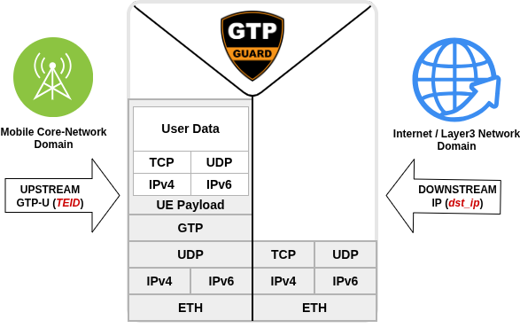
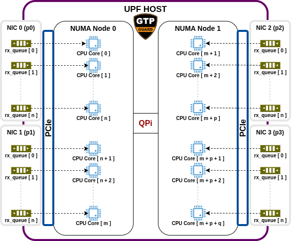
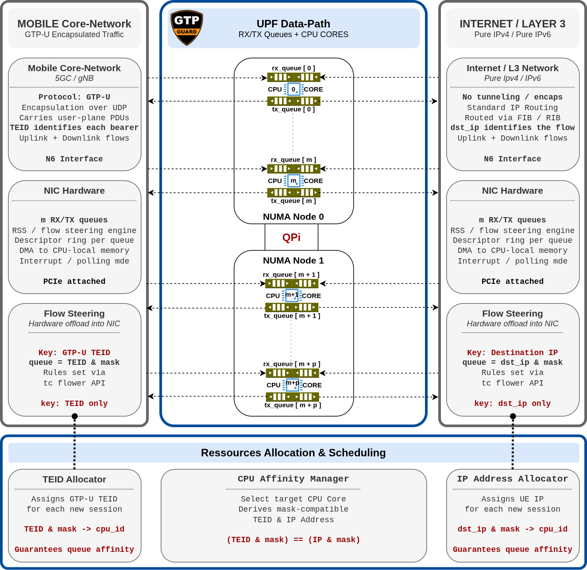
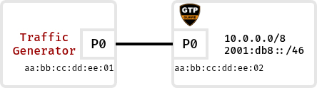

*Alexandre Cassen*, <<acassen@gmail.com>> |
*Olivier Gournet*, <<gournet.olivier@gmail.com>>
---

Modern mobile user-plane deployments (5G UPF, gNB CU-UP) push large volumes of
GTP-U encapsulated traffic through commodity servers fitted with high-speed NICs.
Our goal was to leverage NIC hardware capabilities to reduce complexity while
improving overall performance. Many designs exist, but not all handle large traffic
volumes well. Our target is to achieve around 800 Gbps on a 1RU commodity server.
The UPF is a key routing element in this context: it acts as a border relay between
the mobile core network and a Layer 3 network (Internet or any private network).
The main UPF protocol stack looks like:

<p style="text-align: center"></p>

Mobile Core-Network is encapsulating all UE traffic into GTP until UPF where traffic
is decapsulated and routed to reach the destination network. Each UE session is
identified by a TEID (Tunnel Endpoint Identifier) — a 32-bit value carried in every
GTP-U packet header.

Improving performance at large-scale network is a multi-level engineering journey
spanning hardware selection, system configuration, network engineering, and software
engineering — each layer compounding the gains of the one below.

## Hardware and System Configuration

The platform is a commodity server with two CPU sockets (**Intel Xeon Gold 6342 @
2.80 GHz**), each forming an independent NUMA node. Two **NVIDIA ConnectX-7 HHHL**
adapters (`MCX755106AC-HEAT`, 200GbE / NDR200 IB, 2 ports each) are fitted, one per
NUMA node, attached to the local PCIe bus. Each port exposes multiple `rx_queue`s;
IRQ affinity pins every `rx_queue` to a dedicated core on the same NUMA node:

<p style="text-align: center"></p>

The concrete sizing: **48 cores** total, 24 per NUMA node. Each port is configured
with **8 RX queues** — 16 per adapter, 32 system-wide. Cores 16–23 (NUMA 0) and
40–47 (NUMA 1) are reserved for control-plane and OS tasks:

```
NUMA node 0                          NUMA node 1
CPU  0 – 23                          CPU 24 – 47

ConnectX-7 #0                        ConnectX-7 #1
  port 0:  queues 0–7  → CPU  0–7      port 0:  queues 0–7  → CPU 24–31
  port 1:  queues 0–7  → CPU  8–15     port 1:  queues 0–7  → CPU 32–39
  (remaining cores 16–23 reserved      (remaining cores 40–47 reserved
   for control plane / OS)              for control plane / OS)
```

Hyperthreading is disabled in the BIOS: the workload is memory/interrupt-bound, not
compute-bound, so HT brings no throughput gain. It also collapses logical and physical
core IDs into one contiguous space, removing any ambiguity when pinning `rx_queue`
IRQs.

### System Tweaks

**Deployment model.** Two partitioning strategies were evaluated: VMs with the
ConnectX-7 adapters passed through via VFIO, and direct host (bare-metal or
lightweight containers). Despite careful NUMA and CPU isolation, the VM path
introduced a significant throughput overhead compared to running directly on the host.
For production deployments where performance matters, bare-metal or containers are
strongly preferred over VMs.

**Bare-metal (basic) kernel arguments:**

```
GRUB_CMDLINE_LINUX="hugepagesz=1G hugepages=32 intel_pstate=disable \
                    mitigations=off intel_iommu=on iommu=pt intel_idle.max_cstate=1 \
                    processor.max_cstate=1 cpufreq.default_governor=performance"
```

| Argument | Benefit for UPF |
|---|---|
| `hugepagesz=1G` / `hugepages=32` | 1 GB huge pages reduce TLB pressure on large packet buffers |
| `intel_iommu=on` / `iommu=pt` | Enables the IOMMU; passthrough mode (`pt`) maps DMA addresses 1:1, eliminating IOMMU translation overhead on the data path |
| `intel_idle.max_cstate=1` / `processor.max_cstate=1` | Keeps cores in shallow sleep, eliminating wake-up latency on interrupt delivery |
| `intel_pstate=disable` / `cpufreq.default_governor=performance` | Forces maximum clock frequency, removing P-state transitions on the fast path |
| `mitigations=off` | Removes Spectre/Meltdown overhead on syscall and interrupt paths |

**Bare-metal (data-path core isolation) kernel arguments:**

```
GRUB_CMDLINE_LINUX="hugepagesz=1G hugepages=32 intel_idle.max_cstate=1 \
                    processor.max_cstate=1 intel_pstate=disable \
                    cpufreq.default_governor=performance intel_iommu=on iommu=pt \
                    numa_balancing=disable transparent_hugepage=never \
                    nohz_full=2-23,26-47 rcu_nocbs=2-23,26-47 rcu_nocb_poll \
                    isolcpus=managed_irq,domain,2-23,26-47 irqaffinity=0-1,24-25 \
                    kthread_cpus=0-1,24-25 skew_tick=1 nmi_watchdog=0 nosoftlockup \
                    clocksource=tsc tsc=reliable audit=0 mitigations=off"
```

| Argument | Benefit for UPF |
|---|---|
| `numa_balancing=disable` | Prevents the kernel from migrating pages across NUMA nodes, preserving NIC-local memory affinity |
| `transparent_hugepage=never` | Avoids unpredictable THP compaction stalls on the data path |
| `nohz_full=2-23,26-47` | Disables periodic timer ticks on data-path cores, eliminating tick-driven jitter |
| `rcu_nocbs=2-23,26-47` / `rcu_nocb_poll` | Offloads RCU callbacks to control cores, preventing callback execution on data-path cores |
| `isolcpus=managed_irq,domain,2-23,26-47` | Removes data-path cores from the scheduler domain and IRQ balancing |
| `irqaffinity=0-1,24-25` / `kthread_cpus=0-1,24-25` | Confines system IRQs and kernel threads to control cores |
| `skew_tick=1` | Staggers per-CPU timer firings to avoid lock contention bursts |
| `nmi_watchdog=0` / `nosoftlockup` | Disables watchdog NMIs and soft-lockup detection that would interrupt isolated cores |
| `clocksource=tsc` / `tsc=reliable` | Uses TSC as the sole clock source, avoiding HPET/ACPI overhead on time-sensitive paths |
| `audit=0` | Disables kernel auditing, removing syscall hook overhead |

**NIC tuning (`ethtool`):**

```bash
tune_nic() {
        local dev=$1
        ethtool -K "$dev" gro off lro off gso off tso off
        ethtool -K "$dev" rx-vlan-offload off tx-vlan-offload off
        ethtool -G "$dev" rx 8192 tx 8192
        ethtool -C "$dev" adaptive-rx off adaptive-tx off
        ethtool -C "$dev" rx-usecs 8 rx-frames 64 tx-usecs 8
        ethtool --set-priv-flags "$dev" rx_striding_rq on
        ethtool --set-priv-flags "$dev" rx_cqe_compress on
        ethtool -L "$dev" combined 8
}
```

| Option | Benefit for UPF |
|---|---|
| `gro off` / `lro off` | Disables receive coalescing; UPF must process each GTP-U packet individually — merged packets break per-TEID classification |
| `gso off` / `tso off` | Segmentation offloads are irrelevant for GTP-U encapsulated traffic and add unnecessary overhead |
| `rx-vlan-offload off` / `tx-vlan-offload off` | In hairpin mode the VLAN id is rewritten in-place; offload disabled to prevent stripping or inserting VLAN tags over the packet buffer. VLAN offload would also be of limited benefit here since UPF already touches every frame header for GTP-U encap/decap |
| `rx 8192` / `tx 8192` | Large ring buffers absorb traffic bursts without drops before NAPI can drain the queue |
| `adaptive-rx off` / `adaptive-tx off` | Fixed coalescing eliminates the jitter introduced by adaptive interrupt rate adjustment |
| `rx-usecs 8` / `rx-frames 64` | Interrupt fires after 8 µs or 64 frames; balances latency against CPU overhead for mobile-sized packets |
| `tx-usecs 8` | Coalesces transmit completions over 8 µs, reducing TX interrupt rate without adding meaningful latency |
| `rx_striding_rq on` | Packs multiple packets per WQE, reducing DMA descriptor pressure and improving throughput |
| `rx_cqe_compress on` | Compresses CQE entries, cutting PCIe bandwidth consumed by completion processing |
| `combined 8` | Sets 8 queue pairs per port, matching the IRQ-to-core affinity mapping |

**Kernel network tuning (`sysctl`):**

```bash
sysctl -w net.core.busy_poll=50
sysctl -w net.core.busy_read=50
sysctl -w net.core.netdev_budget=600
sysctl -w net.core.netdev_budget_usecs=8000
```

| Parameter | Benefit for UPF |
|---|---|
| `net.core.busy_poll=50` | Spins the socket poll loop for 50 µs before sleeping, catching back-to-back GTP-U bursts without an interrupt round-trip |
| `net.core.busy_read=50` | Same for the read path; keeps the UPF worker on-CPU during high-frequency packet streams |
| `net.core.netdev_budget=600` | Allows NAPI to process up to 600 packets per poll cycle, amortising scheduling overhead under sustained load |
| `net.core.netdev_budget_usecs=8000` | Extends the NAPI time budget to 8 ms, ensuring large batches complete without premature preemption |

### Pinning `rx_queue` IRQs

With HT disabled and 8 queues per port, the last step is to bind each queue's MSI-X
interrupt to the right core. The script `pin-mlx-irqs.sh` takes a PCI device address
and a CPU list, enumerates all MSI IRQs exposed under
`/sys/bus/pci/devices/<PCI>/msi_irqs/`, and writes each IRQ's target core to
`/proc/irq/<N>/smp_affinity_list`, round-robining across the supplied CPU list.

Our server exposes the four ConnectX-7 ports at the following PCI addresses:

```
$ lspci | grep ConnectX
31:00.0 Ethernet controller: Mellanox Technologies MT2910 Family [ConnectX-7]
31:00.1 Ethernet controller: Mellanox Technologies MT2910 Family [ConnectX-7]
b1:00.0 Ethernet controller: Mellanox Technologies MT2910 Family [ConnectX-7]
b1:00.1 Ethernet controller: Mellanox Technologies MT2910 Family [ConnectX-7]
```

Bus `31:xx` sits on NUMA node 0, bus `b1:xx` on NUMA node 1. The script is called
once per port with the 8 data-path cores of the local NUMA node:

```
# ConnectX-7 #0  (NUMA node 0, PCIe 0000:31:00.x)
./pin-mlx-irqs.sh 0000:31:00.0 0-7    # port 0 → CPU 0–7
./pin-mlx-irqs.sh 0000:31:00.1 8-15   # port 1 → CPU 8–15

# ConnectX-7 #1  (NUMA node 1, PCIe 0000:b1:00.x)
./pin-mlx-irqs.sh 0000:b1:00.0 24-31  # port 0 → CPU 24–31
./pin-mlx-irqs.sh 0000:b1:00.1 32-39  # port 1 → CPU 32–39
```

Sample output for the first port confirms one IRQ per core, cycling through CPUs 0–7:

```
PCI device: 0000:31:00.0
CPU list: 0 1 2 3 4 5 6 7
Assign IRQ 176 → CPU 0
Assign IRQ 177 → CPU 1
Assign IRQ 200 → CPU 2
...
Assign IRQ 220 → CPU 6
```

Each data-path core now handles exactly one source of interrupts: its own `rx_queue`.

## Hairpin Forwarding

In a standard UPF design, a decapsulated UE packet leaving the GTP tunnel must
traverse the kernel network stack twice: once on ingress (core-network side) and once
on egress (Internet/L3 side), typically through two distinct physical interfaces. This
doubles the per-packet processing cost and consumes precious CPU cycles on the data
path.

Hairpin mode eliminates this by turning the NIC itself into the forwarding element.
Each physical port is split into two logical segments via VLANs: one VLAN carries
traffic from the mobile core-network (GTP-U encapsulated), the other carries traffic
toward the Internet or L3 network (decapsulated). When the UPF forwards a packet, it
rewrites the VLAN id in-place and hands the frame back to the same port — no packet
buffer copy, no second DMA, no extra NIC traversal.

```
ConnectX-7 port
  ├── VLAN A  ←→  Mobile Core-Network  (GTP-U encapsulated)
  └── VLAN B  ←→  Internet / L3 Network (decapsulated)
```

The VLAN tag is overwritten directly in the existing buffer, which is why NIC VLAN
offload is disabled: allowing the hardware to strip or insert tags would require
expanding or shrinking the buffer, breaking the zero-copy rewrite assumption. Beyond
that constraint, VLAN offload carries less benefit in the UPF case than in a plain
Ethernet forwarding scenario: because the forwarding process performs GTP-U
encapsulation or decapsulation on every packet, the CPU is already touching the full
frame header, making hardware-assisted VLAN tag manipulation a marginal saving at best.

## Steering Policy

With hardware initialised and system tuned, the remaining question is: how does a
packet arriving at a port know which `rx_queue` — and therefore which CPU core — it
belongs to? Modern NICs implement this entirely in firmware, before any DMA write,
through two distinct mechanisms:

**Receive Side Scaling (RSS)** is the baseline. The NIC firmware computes a Toeplitz
hash over a fixed set of header fields (typically the outer IP/UDP 4-tuple) and uses
the result to index an indirection table that maps to an `rx_queue`. Distribution is
statistically uniform across flows but offers no control: the operator cannot direct
a specific flow to a specific queue, and the hash function is blind to any header
field the firmware was not programmed to inspect.

!!! note
    ConnectX-7 firmware advertises `MLX5_FLEX_PARSER_GTPU_ENABLED`, confirming the
    hardware can parse GTP-U headers. Two attempts were made to exploit this for RSS:

    **Kernel driver extension.** We extended the mlx5e driver at the TTC and RSS
    subsystems to set `MLX5_HASH_FIELD_SEL_GTPU_TEID` on the receive TIR, using
    `1 << 20` as its value. This is pure speculation — we are almost certainly wrong
    without the PRM to confirm the actual bit assignment.

    **DPDK draft.** A quick proof-of-concept configured `rxmode.mq_mode` to
    `RTE_ETH_MQ_RX_RSS` and installed an `RTE_FLOW_ACTION_TYPE_RSS` action flow.
    This was also rejected by the firmware without further diagnostic.

    Both attempts were inconclusive. Confirming whether TEID-based RSS is reachable
    at all would require the NVIDIA kernel team and access to the ConnectX-7 PRM.
    Regardless, RSS was ultimately abandoned: even if it worked, its non-deterministic
    nature would prevent the strict per-UE CPU affinity that makes flow steering
    valuable in this design.

**Flow Steering** (also referred to as ntuple filtering or TC flower offload depending
on the interface) replaces probabilistic hashing with explicit match-action rules
programmed into the NIC flow table. The firmware evaluates each arriving packet
against the rule set and places it in the queue designated by the matching rule.
Classification is deterministic and field-flexible: any header field the NIC parser
can reach — including tunnel headers and inner payloads — can be used as a match key.

The key differences:

| | RSS | Flow Steering |
|---|---|---|
| Queue selection | Hash-based, probabilistic | Rule-based, deterministic |
| Match fields | Fixed outer 4-tuple | Any field reachable by NIC parser |
| Operator control | Indirection table only | Per-rule queue assignment |
| Same-flow affinity | Best-effort | Guaranteed |

Both mechanisms operate entirely inside the NIC firmware. The CPU is not involved in
the classification decision; by the time the interrupt fires, the packet is already
in the correct ring buffer.

Each approach carries distinct performance and complexity trade-offs:

| Criterion | RSS | Flow Steering |
|---|---|---|
| Distribution uniformity | Toeplitz hash, uniform regardless of input skew | Depends on TEID allocation pattern — skewed allocations starve some queues |
| Queue count scalability | O(1) via RETA — any count, any size | O(N) rules bounded by flow table capacity |
| Non-power-of-2 queues | Native | Requires multiple rules per queue |
| Live rebalancing | Atomic per-entry RETA update, no gap | Full rule reinstall, brief coverage gap |
| Pipeline latency | Lower — hash + single RETA lookup | Higher — full flow table priority/group lookup chain |
| Unmatched traffic | All traffic distributed | Falls to default path (queue 0 or outer-IP RSS) |
| Rule installation cost | Cheap RETA write | Firmware mailbox round-trip per rule |

For GTP-U traffic, standard RSS hashes the outer IP/UDP 4-tuple, ignoring the TEID
entirely — thousands of tunnels sharing the same outer address pair collapse onto a
handful of queues. Even if RSS over the TEID were functional, it would remain
non-deterministic: the Toeplitz hash gives no guarantee that packets from the same
UE session land consistently on the same queue. This defeats any attempt at per-UE
CPU affinity.

We therefore chose flow steering despite its higher complexity: offloading
classification to the NIC firmware — even through a deeper pipeline — is always
preferable to consuming CPU cycles on the data path. The rule installation and
matching cost is further contained by our topology: with only 8 `rx_queue`s per
port, the flow table stays small (16 rules per adapter, 32 system-wide), keeping
the firmware lookup chain short and rule management straightforward.

With hardware initialised, system tuned, IRQs pinned, and the steering mechanism
chosen, all the building blocks are in place. The following section details how
flow steering is concretely applied to our UPF traffic.

### Flow Steering for UPF

The core design principle is **range partitioning**: given a W-bit field and N
queues (N a power of 2), the field space is split into N equal non-overlapping
ranges using the top `k = log2(N)` bits:

```
k       = log2(N)                    # bits needed to index N queues
mask    = ((1 << k) - 1) << (W - k)  # top-k bits set, remainder zero
base[i] = i << (W - k)               # i = 0 … N-1
```

Queue i matches any packet where `field & mask == base[i]`. The mask is identical
across all rules; only the base changes per queue. This formula applies uniformly
to both traffic directions — upstream on the TEID field, downstream on the IP
destination address.

Applied to our 8-queue topology (k=3):

**Upstream (core-network → UPF).** W=32, field = GTP-U TEID:

```
queue 0  TEID & 0xe0000000 == 0x00000000  →  CPU  0
queue 1  TEID & 0xe0000000 == 0x20000000  →  CPU  1
...
queue 7  TEID & 0xe0000000 == 0xe0000000  →  CPU  7
```

The control plane allocates TEIDs from the range matching the target queue, making
session placement a scheduling decision taken once at setup time — the hardware
enforces it at line rate for the lifetime of the session.

**Downstream (Internet/L3 → UPF).** Field = IP destination address. For IPv4
(W=32), an operator prefix `10.0.0.0/8` split over 8 queues borrows 3 bits,
yielding mask `255.224.0.0`:

```
queue 0  dst & 255.224.0.0 == 10.0.0.0    →  CPU  0
queue 1  dst & 255.224.0.0 == 10.32.0.0   →  CPU  1
...
queue 7  dst & 255.224.0.0 == 10.224.0.0  →  CPU  7
```

For IPv6 (W=128), an operator prefix `2001:db8::/46` split over 8 queues borrows
3 bits, yielding `/49` sub-prefixes with mask `ffff:ffff:ffff:8000::`:

```
queue 0  dst & ffff:ffff:ffff:8000:: == 2001:db8::           →  CPU  0
queue 1  dst & ffff:ffff:ffff:8000:: == 2001:db8:0:8000::    →  CPU  1
...
queue 7  dst & ffff:ffff:ffff:8000:: == 2001:db8:3:8000::    →  CPU  7
```

A UE session steered to CPU N on ingress is processed on CPU N on egress, keeping
UE context fully core-local in both directions with no cross-core coordination.

Computing these masks by hand is error-prone; the `ip-pfx-split` tool automates
the calculus — given a prefix and a queue count it outputs the mask and one base
address per queue. It will be used directly when configuring the flow steering
rules covered in the flow steering configuration section:

```
$ ./ip-pfx-split 10.0.0.0/8 8
q0   10.0.0.0/255.224.0.0
q1   10.32.0.0/255.224.0.0
q2   10.64.0.0/255.224.0.0
q3   10.96.0.0/255.224.0.0
q4   10.128.0.0/255.224.0.0
q5   10.160.0.0/255.224.0.0
q6   10.192.0.0/255.224.0.0
q7   10.224.0.0/255.224.0.0

$ ./ip-pfx-split 2001:db8::/46 8
q0   2001:db8::/ffff:ffff:ffff:8000::
q1   2001:db8:0:8000::/ffff:ffff:ffff:8000::
q2   2001:db8:1::/ffff:ffff:ffff:8000::
q3   2001:db8:1:8000::/ffff:ffff:ffff:8000::
q4   2001:db8:2::/ffff:ffff:ffff:8000::
q5   2001:db8:2:8000::/ffff:ffff:ffff:8000::
q6   2001:db8:3::/ffff:ffff:ffff:8000::
q7   2001:db8:3:8000::/ffff:ffff:ffff:8000::
```

### Benefits of Range Partitioning

Range partitioning is more than a static distribution scheme — it is the foundation
for dynamic, fine-grained resource management on a live system.

Each `rx_queue` is an isolated, independently measurable resource unit: a dedicated
CPU core, a slice of TEID space, and a shard of UE context memory. The hardware
enforces the mapping, giving the UPF resource allocator real-time visibility into
each bucket at zero coordination cost.

**Session placement as a scheduling decision.** Assigning a new UE session is no
longer a simple TEID allocation from a flat pool — it is a scheduling decision driven
by live metrics:

- **CPU load** — steer new sessions away from cores already near saturation.
- **Active UEs per queue** — balance session count to avoid context-shard hot-spots.
- **Port bandwidth** — avoid placing heavy UEs on already-saturated queues.
- **Class of service** — isolate traffic classes onto dedicated cores to enforce service guarantees.

The UPF resource allocator acts by choosing which TEID range to allocate from at
session establishment. No packet re-classification or runtime thread migration is
needed; the hardware enforces the placement from the first data packet onwards. This
scheduling layer also naturally encodes QoS policy: premium subscribers land on
lightly loaded cores, best-effort or heavy-consumption subscribers are isolated to
dedicated ones, bounding their impact on the rest of the system.

**Lock-free data-path.** Because all traffic for a given UE is pinned to one core,
the UE context is thread-local state — no locks, no cross-core coordination anywhere
on the fast path.

The practical impact becomes clear with UE usage reporting, which underpins billing,
quota enforcement, and roaming settlements. In a conventional RSS-based UPF, a
session's packets may be processed by any core at any time, so producing a usage
report requires aggregating per-CPU counters under locks. Quota triggers are worse:
per-packet threshold checks across multiple CPUs under locking are prohibitively
expensive, so designs fall back to periodic polling. Accuracy then depends on polling
frequency — but aggressive polling starves the routing pipeline, and even so it can
never match a synchronous per-packet trigger. The polling window silently misses
traffic forwarded between two collection passes, introducing measurement gaps that
are hard to detect because they corrupt the very source of the metrics. For roaming
traffic, where billing accuracy has direct financial and regulatory consequences,
this is a fundamental design flaw.

With range partitioning, counters are core-local scalars, quota triggers fire
synchronously on the data path, and usage reports read a single shard of state —
no aggregation, no polling, no gap.

### Challenges of Range Partitioning

Range partitioning is only effective when the UPF controls the fields it partitions
on. Several real-world deployment constraints can break this assumption.

**IP address allocation by SMF.** The most impactful limitation applies to the
downstream path. In a standard 3GPP deployment, UE IP addresses are allocated by
the SMF, not the UPF. The UPF has no influence over which address is assigned to
which session. If the SMF draws from the operator prefix arbitrarily — or from a
flat pool without awareness of the UPF's queue topology — the sub-prefix-to-queue
mapping becomes meaningless: downstream traffic lands on whatever queue owns the
destination sub-prefix, with no correlation to the upstream queue handling the same
UE. The result is load imbalance on the downstream path, which is precisely where
the bulk of user-plane traffic flows.

Resolving this requires either co-locating IP allocation logic within the UPF so
it can choose addresses aligned with the target queue, or defining an interface
between SMF and UPF that exposes the partitioning topology. Neither is standardised
in current 3GPP releases, making this an open integration challenge for operators
deploying this design.

**Static partitioning under dynamic load.** Range boundaries are fixed at rule
installation time. A sudden concentration of heavy sessions in one TEID range will
saturate the corresponding core while others remain idle. The partitioning cannot
rebalance in flight — doing so would require moving active sessions to new TEID
ranges, which implies signalling to the peer and re-establishing GTP tunnels.
Careful capacity planning and CoS-aware session placement mitigate this, but do not
eliminate it.

**Per-UE throughput ceiling.** Since all traffic for a session is pinned to one
core, the maximum throughput achievable for a single UE is bounded by the processing
capacity of that core. Distributing a single session across all CPUs would in theory
yield higher peak throughput for that individual flow.

In practice, this is not a real concern. With tens of thousands of concurrent
sessions, the law of large numbers produces a statistically uniform distribution of
load across queues — the aggregate throughput across all cores is fully utilised.
Furthermore, the radio access network itself imposes a natural ceiling: the gNB
traffic scheduler allocates spectrum resources per UE based on radio conditions and
CellID capacity, so no single session can realistically saturate a CPU core before
the radio layer becomes the bottleneck. Both effects combined make per-UE CPU pinning
a non-issue for any realistic mobile deployment.

**Dual-stack session affinity.** A UE session can carry both IPv4 and IPv6
traffic simultaneously. Maintaining CPU pinning across both address families
requires that the IPv4 and IPv6 downstream addresses allocated to the same session
both map to the same `rx_queue`. This means the allocation rule must be applied
consistently across both prefix spaces: the queue index derived from the IPv4
address must equal the queue index derived from the IPv6 address for the same UE.
If IP allocation is handled externally — as discussed above for the SMF case — this
constraint is even harder to enforce, since it requires the allocator to be aware of
both the queue topology and the dual-stack pairing. Any mismatch splits a single
UE's downstream traffic across two cores, breaking the lock-free guarantee and
reintroducing cross-core state sharing for that session.

## Functional Overview

The diagram below summarises all the building blocks described so far into a single
view: hardware topology, NUMA affinity, queue partitioning, IRQ pinning,
bidirectional traffic locality and Hairpin forwarding.

**`tx_queue` affinity.** The `ethtool -L combined 8` setting creates 8 queue
*pairs* per port — each pair holds one `rx_queue` and one `tx_queue` sharing the
same NUMA-local DMA ring. XPS (Transmit Packet Steering) maps each CPU to its
paired `tx_queue`, so when a core finishes processing a UE packet and sends the
reply it submits the packet to its own ring without touching any other core's state.
Both legs of a UE session — receive and transmit — are therefore handled by the
same CPU, keeping the UE context shard continuously warm in local cache.

<p style="text-align: center"></p>

## Flow Steering Configuration

This section walks through a concrete end-to-end validation of the flow steering
design. The goal is to show that every traffic class — GTP-U over IPv4, GTP-U over
IPv6, plain IPv4, and plain IPv6 — lands on the expected `rx_queue` after the
steering rules are installed.

### Prerequisites

Standard kernel TC flower and iproute2 do not yet support the two primitives this
design relies on: masked `enc_key_id` matching (for TEID range rules) and arbitrary
subnet-mask matching on IP destination addresses (for sub-prefix rules). Both
require out-of-tree patches.

**Kernel patches** (`patch-kernel/`) — currently under review by the NVIDIA kernel
team for upstream integration:

| Patch | Purpose |
|---|---|
| `0001-net-mlx5e-TC-offload-rx_queue-action-to-NIC-flow.patch` | Adds `skbedit queue_mapping` offload support to the mlx5e TC path so the NIC firmware enforces queue assignment without CPU involvement |
| `0002-net-mlx5e-Support-GTP-U-TEID-range-matching-in-flowe.patch` | Exposes masked TEID matching to the flower classifier, enabling range-based GTP-U steering rules |

**iproute2 TC patches** (`patch-iproute2/`):

| Patch | Purpose |
|---|---|
| `0001-tc-f_flower-add-mask-support-for-enc_key_id.patch` | Extends the `enc_key_id` flower key to accept a `/mask` suffix, required to express TEID ranges |
| `0002-tc-f_flower-support-arbitrary-mask-in-IP-address-mat.patch` | Allows non-CIDR subnet masks on `dst_ip`, required to express the sub-prefix ranges produced by `ip-pfx-split` |

Apply kernel patches with `git am`, rebuild and install. Apply iproute2 patches
the same way, then rebuild the `tc` binary and place it alongside the scripts.

### Test Environment

<p style="text-align: center"></p>

The setup involves two nodes connected back-to-back:

- **Traffic Generator** — sends one crafted packet per partition range across all
  four traffic classes.
- **UPF** — receives traffic on `p0`, flow steering rules direct each packet to the
  correct `rx_queue`.

### UPF Node: Installing Steering Rules

`setup-fs.sh` installs the full rule set in one shot. It relies on `teid-split`
and `ip-pfx-split` to generate the per-queue base/mask pairs, then feeds them
directly into `tc filter add` commands:

```bash
$ ./setup-fs.sh
```

The script installs three rule groups on `p0 ingress`:

- **GTP-U** (over IPv4 and IPv6): 8 rules per address family matching
  `enc_key_id <base>/0xe0000000` on VLAN 522, steered to queues 0–7.
- **IPv6 L3**: 8 rules matching `dst_ip 2001:db8:<sub-prefix>/ffff:ffff:ffff:8000::`
  on VLAN 522, steered to queues 0–7.
- **IPv4 L3**: 8 rules matching `dst_ip 10.<n>.0.0/255.224.0.0`
  on VLAN 522, steered to queues 0–7.

#### Rule anatomy

A GTP-U steering rule for queue 1 looks like:

```bash
tc filter add dev p0 ingress protocol 802.1q flower skip_sw \
        vlan_id 522 vlan_ethtype ip                         \
        enc_dst_port 2152 enc_key_id 0x20000000/0xe0000000  \
        action skbedit queue_mapping 1 skip_sw
```

Breaking it down field by field:

| Field | Value | Meaning |
|---|---|---|
| `dev p0 ingress` | — | Match on the ingress path of port `p0` |
| `protocol 802.1q` | — | Outer Ethernet type is 802.1Q; the frame carries a VLAN tag |
| `flower` | — | Use the flower classifier (match-action rule engine) |
| `skip_sw` | — | **Hardware offload only** — do not fall back to software classification (see below) |
| `vlan_id 522` | — | Match the VLAN tag value; distinguishes the L3/Internet-side traffic from the core-network side |
| `vlan_ethtype ip` | `ipv6` for IPv6 | Inner Ethernet type after VLAN strip; selects the outer IP version carrying the GTP-U tunnel |
| `enc_dst_port 2152` | — | Match the UDP destination port of the GTP-U tunnel (standard GTP-U port) |
| `enc_key_id 0x20000000/0xe0000000` | — | Match the GTP-U TEID against a base/mask pair; any TEID whose top 3 bits equal `001` lands here |
| `action skbedit queue_mapping 1` | — | Place the matched packet into `rx_queue` 1 |
| `skip_sw` *(on action)* | — | Offload the action to the NIC; the CPU is not involved in executing it |

The equivalent rule for IPv4 L3 steering on queue 1:

```bash
tc filter add dev p0 ingress protocol 802.1q flower skip_sw \
        vlan_id 522 vlan_ethtype ip                         \
        dst_ip 10.32.0.0/255.224.0.0                        \
        action skbedit queue_mapping 1 skip_sw
```

Here `dst_ip` uses a non-CIDR subnet mask (`255.224.0.0`) to express the
sub-prefix range produced by `ip-pfx-split`. Any destination address in
`10.32.0.0–10.63.255.255` matches and is steered to queue 1.

**Why `skip_sw` is critical.** Without it the kernel installs the rule in
software (in the kernel's own classifier) as a fallback. Software classification
means the packet is DMA'd to a ring buffer, the CPU takes an interrupt,
processes the packet through the classifier, and only then decides which queue
it belongs to — by which point the packet is already in memory and the queue
assignment is meaningless as a routing decision. The CPU has done the work the
NIC should have done. `skip_sw` makes the rule hardware-only: if the NIC
firmware cannot offload it (wrong match fields, table full, firmware limitation),
`tc` returns an error rather than silently falling back to software. This turns
a misconfiguration into an explicit failure, which is exactly what is needed in
a performance-critical path.

#### Rule partition tables

```
$ ./teid-split 8
q0   0x00000000/0xe0000000
q1   0x20000000/0xe0000000
q2   0x40000000/0xe0000000
q3   0x60000000/0xe0000000
q4   0x80000000/0xe0000000
q5   0xa0000000/0xe0000000
q6   0xc0000000/0xe0000000
q7   0xe0000000/0xe0000000

$ ./ip-pfx-split 10.0.0.0/8 8
q0   10.0.0.0/255.224.0.0
q1   10.32.0.0/255.224.0.0
q2   10.64.0.0/255.224.0.0
q3   10.96.0.0/255.224.0.0
q4   10.128.0.0/255.224.0.0
q5   10.160.0.0/255.224.0.0
q6   10.192.0.0/255.224.0.0
q7   10.224.0.0/255.224.0.0

$ ./ip-pfx-split 2001:db8::/46 8
q0   2001:db8::/ffff:ffff:ffff:8000::
q1   2001:db8:0:8000::/ffff:ffff:ffff:8000::
q2   2001:db8:1::/ffff:ffff:ffff:8000::
q3   2001:db8:1:8000::/ffff:ffff:ffff:8000::
q4   2001:db8:2::/ffff:ffff:ffff:8000::
q5   2001:db8:2:8000::/ffff:ffff:ffff:8000::
q6   2001:db8:3::/ffff:ffff:ffff:8000::
q7   2001:db8:3:8000::/ffff:ffff:ffff:8000::
```

### UPF Node: Monitoring

`xdp-rss-mon` attaches the `xdp_rss` BPF program to the interface in driver mode.
At the earliest point in the receive path it logs each packet's `rx_queue` index
along with the TEID (for GTP-U) or destination IP (for plain IPv4/IPv6), via
`bpf_printk` read back from `trace_pipe`. The result is a live confirmation that
NIC firmware steering is placing every packet on the intended queue.

Launch `xdp-rss-mon` on `p0` before starting the traffic generator:

```bash
$ sudo ./xdp-rss-mon -i p0
XDP program 'xdp_rss' attached to interface 'p0' (ifindex 5)
RSS activity monitoring... (Ctrl-C to stop)
```

A `tcpdump` on `p0` provides a parallel view at the Ethernet level:

```bash
$ sudo tcpdump -i p0 -l -n
```

### Traffic Generator Node: Sending Test Traffic

`test-fs.sh` iterates over every partition range for all four traffic classes and
sends one packet per range using `pkt-send.py`:

```bash
$ ./test-fs.sh
=== GTP-U over IPv4 TEID steering ===
Sending 1 GTP-U packet(s): TEID=0x00000001  p0.522  IPv4
Sending 1 GTP-U packet(s): TEID=0x20000000  p0.522  IPv4
...
=== GTP-U over IPv6 TEID steering ===
Sending 1 GTP-U packet(s): TEID=0x00000001  p0.522  IPv6
...
=== IPv4 destination steering ===
Sending 1 UDP packet(s): p0.522  IPv4
...
=== IPv6 destination steering ===
Sending 1 UDP packet(s): p0.522  IPv6
...
```

### Results

**`xdp-rss-mon` output** confirms each packet was delivered to the queue matching
its partition. Each `rx_queue` index corresponds exactly to the queue selector
embedded in the TEID or destination address:

```
<idle>-0  [000] xdp_rss: GTP-U/IPv4 rx_queue=0 teid=0x00000001
<idle>-0  [001] xdp_rss: GTP-U/IPv4 rx_queue=1 teid=0x20000000
<idle>-0  [002] xdp_rss: GTP-U/IPv4 rx_queue=2 teid=0x40000000
<idle>-0  [003] xdp_rss: GTP-U/IPv4 rx_queue=3 teid=0x60000000
<idle>-0  [004] xdp_rss: GTP-U/IPv4 rx_queue=4 teid=0x80000000
<idle>-0  [005] xdp_rss: GTP-U/IPv4 rx_queue=5 teid=0xa0000000
<idle>-0  [006] xdp_rss: GTP-U/IPv4 rx_queue=6 teid=0xc0000000
<idle>-0  [007] xdp_rss: GTP-U/IPv4 rx_queue=7 teid=0xe0000000
<idle>-0  [000] xdp_rss: GTP-U/IPv6 rx_queue=0 teid=0x00000001
<idle>-0  [001] xdp_rss: GTP-U/IPv6 rx_queue=1 teid=0x20000000
...
<idle>-0  [000] xdp_rss: IPv4 rx_queue=0 dst=0a000000
<idle>-0  [001] xdp_rss: IPv4 rx_queue=1 dst=0a200000
...
<idle>-0  [000] xdp_rss: IPv6 rx_queue=0 dst=20010db8000000000000000000000000
<idle>-0  [001] xdp_rss: IPv6 rx_queue=1 dst=20010db8000080000000000000000000
...
```

**`tcpdump` output** on the UPF confirms the wire-level packet flow. GTP-U
packets carry port 2152; plain UDP packets carry port 1234:

```
15:59:56.799387 IP  192.168.1.1.2152 > 192.168.1.2.2152: UDP, length 12
...
15:59:59.402448 IP6 fd00::1.2152    > fd00::2.2152:    UDP, length 12
...
16:00:02.004321 IP  172.16.0.1.1234 > 10.0.0.0.1234:   UDP, length 4
16:00:02.332330 IP  172.16.0.1.1234 > 10.32.0.0.1234:  UDP, length 4
...
16:00:04.622405 IP6 fd00::1.1234    > 2001:db8::.1234: UDP, length 4
16:00:04.952386 IP6 fd00::1.1234    > 2001:db8:0:8000::.1234: UDP, length 4
...
```

Every packet lands on the queue determined solely by its TEID range or destination
sub-prefix — classification performed entirely inside the NIC firmware, with zero
CPU involvement on the classification path.

## Reference Materials

All tools described in this article are available at
[https://github.com/acassen/research](https://github.com/acassen/research) under
the `UPF-flow-steering/` folder.

| Tool | Description |
|---|---|
| `pin-mlx-irqs.sh` | Binds each ConnectX-7 MSI-X `rx_queue` interrupt to a dedicated data-path core |
| `setup-fs.sh` | Installs GTP-U and Layer 3 flow steering rules on the UPF node via `tc flower` |
| `test-fs.sh` | Sends one packet per partition range across all traffic classes from the Traffic Generator node |
| `ip-pfx-split.c` | Splits an IPv4 or IPv6 prefix over N queues and outputs the per-queue base/mask pairs |
| `teid-split.c` | Splits the 32-bit GTP-U TEID space (or a sub-range) over N queues and outputs the per-queue base/mask pairs |
| `pkt-send.py` | Forges and sends GTP-U or plain UDP packets over IPv4 or IPv6 using Scapy |
| `xdp-rss-mon` | Attaches an XDP BPF program to a NIC port and reports the `rx_queue` and key header fields for every arriving packet |


